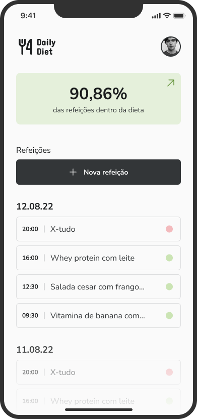
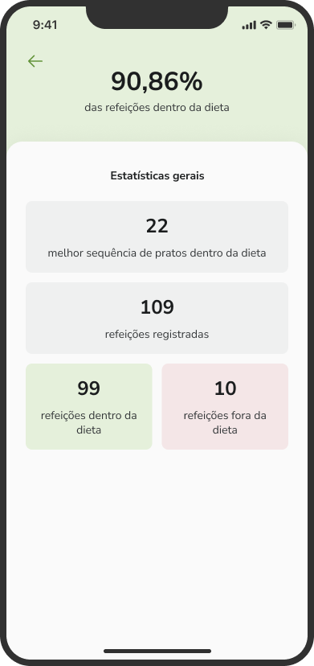
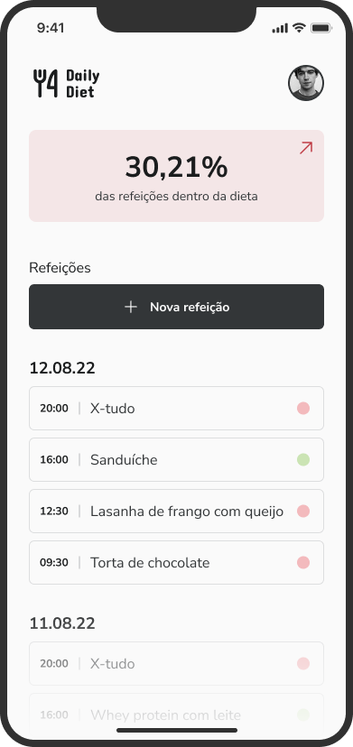
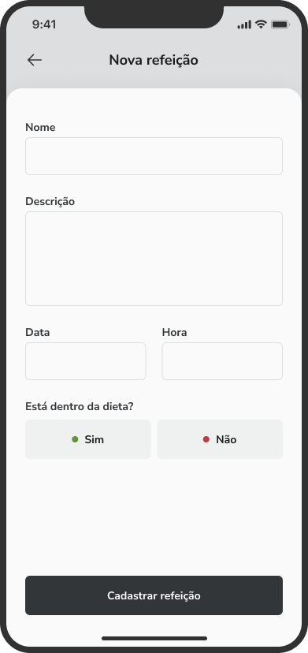
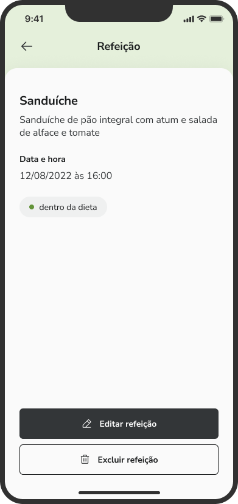
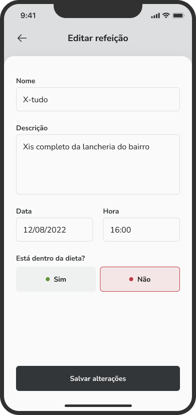
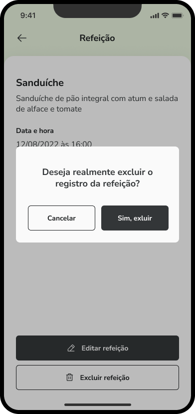

# DAILYDIET

<p align="center">
  
</p>

> The present project is an App expo managed with a list of tasks using `navigation` e `async storage`. The App covers create, update and delete meals.

<p  align="center">
  
  
  
  
  
  
  
  
  
  
  
  
  
  
</p>

## ✨ Features

The project is still under development and the next updates will focus on the following tasks:

- ✅Creating a New Meal
- ✅Toggle if the meal is in diet
- ✅Update meal's data
- ✅Delete a meal
- ✅Save data using AsyncStorage
- ⌛Choose a photo by your gallery using AsyncStorage

## 💻 Prerequisites

Before you begin, make sure you've met the following requirements:

- Minimum requirements to run an Expo project: https://docs.expo.dev/get-started/installation/
- To run the app on a real device, ensure that your device has the updated ExpoGo App.

## 🚀 Running the App

After installing the packages just run the command:

```
npx expo start
```

This will open a terminal containing a barcode and additional options.

- To run on Android device, open the Expo Go App and click on: "Scan QR code" and aim at the QR code displayed on the terminal.
- To run on iOS device, open the camera and aim at the QR code displayed in the terminal, then click on "Open with Expo Go"
- To open in Android emulator you need to have the android environment configured, as described in https://reactnative.dev/docs/environment-setup, then just click on the terminal and press the letter "a".
- To open in iOS emulator you need to have the iOS environment configured, as described in https://reactnative.dev/docs/environment-setup, then just click on the terminal and press the letter "i".

